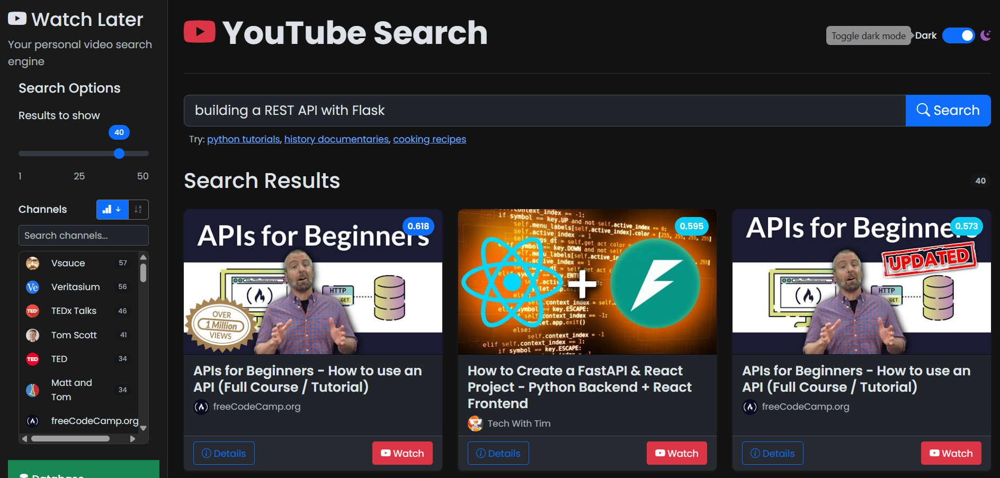

\

# YouTube Watch Later Semantic Search

A semantic search engine for your YouTube \'Watch Later\' list. This project uses Google\'s Gemini embedding model to understand the meaning behind your search queries and finds relevant videos from your saved list stored in a ChromaDB vector database.





## Features

-   **Semantic Search:** Goes beyond keyword matching to understand the intent and context of your search queries.
-   **Google Gemini Embeddings:** Uses the `models/text-embedding-004` model for generating high-quality vector embeddings of video metadata.
-   **ChromaDB Integration:** Stores and efficiently searches through video embeddings.
-   **YouTube Data API:** Fetches detailed video information (titles, descriptions, tags, channel).
-   **Data Ingestion:** Processes your YouTube \'Watch Later\' list from a CSV export (e.g., Google Takeout).

## Project Structure

```
.
├── app.py                  # Main Flask app 
├── config.py               # Configuration settings (API keys, file paths, model params)
├── embedding_utils.py      # Utility functions for Gemini and ChromaDB
├── ingest_data.py          # Script to process CSV and populate ChromaDB
├── requirements.txt        # Python dependencies
├── search_app.py           # Core search logic
├── streamlit_app.py        # Streamlit web application
├── Watch later-videos.csv  # Your YouTube \'Watch Later\' export
├── chroma_watch_later_db/  # ChromaDB vector store
├── images/                 # Screenshots for README
├── static/                 # Static assets for web interface (CSS, JS)
└── templates/              # HTML templates for web interface
```

## Setup and Installation

1.  **Clone the repository:**

    ```bash
    git clone <repository-url>
    cd youtube-semantic-search
    ```

2.  **Create a virtual environment and activate it:**

    ```bash
    python -m venv venv
    # On Windows
    .\\venv\\Scripts\\activate
    # On macOS/Linux
    source venv/bin/activate
    ```

3.  **Install dependencies:**

    ```bash
    pip install -r requirements.txt
    ```

4.  **Set up API Keys:**

    -   Create a `.env` file in the root directory.
    -   Add your API keys to the `.env` file:
        ```env
        YOUTUBE_API_KEY="YOUR_YOUTUBE_API_KEY"
        GEMINI_API_KEY="YOUR_GEMINI_API_KEY"
        ```
    -   You can obtain a YouTube API key from the [Google Cloud Console](https://console.cloud.google.com/).
    -   You can obtain a Gemini API key from [Google AI Studio](https://aistudio.google.com/app/apikey).

5.  **Prepare your YouTube Data:**
    -   Export your \'Watch Later\' list from YouTube. Typically, this can be done via [Google Takeout](https://takeout.google.com/). Ensure you get a CSV file.
    -   Place the CSV file in the root directory and name it `Watch later-videos.csv` (or update `TAKEOUT_CSV_FILE` in `config.py`).

## Usage

1.  **Ingest Data:**
    Run the ingestion script to process your YouTube data, fetch details, generate embeddings, and store them in ChromaDB.

    ```bash
    python ingest_data.py
    ```

    This script will:

    -   Read video IDs from your CSV.
    -   Fetch video details (title, description, tags) using the YouTube API.
    -   Generate embeddings for the video metadata using the Gemini API.
    -   Store the embeddings and metadata in the ChromaDB collection specified in `config.py` (`youtube_videos_gemini_std_v2`).

2.  **Run the Search Application:**
    Launch the web application:

    ```bash
    python app.py
    ```

    This will open the search interface in your web browser.

3.  **Search Your Videos:**
    -   Enter your search query in the text input field.
    -   Adjust the number of results to display using the sidebar slider.
    -   The application will display relevant videos from your \'Watch Later\' list, along with their thumbnails, titles, channels, and a relevance score.
    -   You can expand each result to watch the video directly or view its metadata and the text used for embedding.

## Configuration

Key configuration options can be found in `config.py`:

-   `YOUTUBE_API_KEY`, `GEMINI_API_KEY`: Your API keys (preferably set via `.env`).
-   `TAKEOUT_CSV_FILE`: Path to your YouTube \'Watch Later\' CSV.
-   `CHROMA_DB_PATH`: Directory to store the ChromaDB database.
-   `EMBEDDING_MODEL_NAME`: The Gemini embedding model to use.
-   `CHROMA_COLLECTION_NAME`: Name of the collection in ChromaDB.
-   `DEFAULT_SEARCH_RESULTS`: Default number of search results to display.

## Dependencies

The main dependencies are listed in `requirements.txt`:

-   `pandas`: For data manipulation, especially reading the CSV.
-   `google-api-python-client`: For interacting with the YouTube Data API.
-   `google-genai`: For using the Google Gemini embedding models.
-   `chromadb`: The vector database for storing and searching embeddings.
-   `tqdm`: For displaying progress bars during data ingestion.
-   `python-dotenv`: For managing environment variables (API keys).
-   `streamlit`: For creating the web application interface.
-   `flask`: (If used for a backend API, otherwise can be removed if only Streamlit is used).

## Contributing

Contributions are welcome! Please feel free to submit a pull request or open an issue.

## License

This project is licensed under the MIT License. See the `LICENSE` file for details (if applicable).
